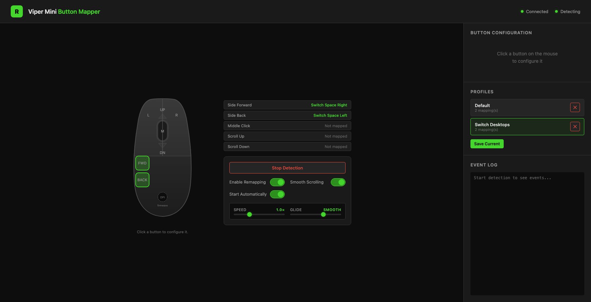

# Razer Viper Mini — Button Mapper for macOS

A lightweight macOS application to detect and remap all Razer Viper Mini mouse buttons to custom keyboard shortcuts. Built as an alternative to Razer Synapse for Mac.



## The Interface

**Mouse diagram** — every remappable button is a clickable zone. Zones glow green when a mapping is assigned and flash on a real button press, so you can confirm the app sees your hardware. The DPI button is drawn dashed because onboard firmware handles it and macOS never sees it.

**Assignments** — what each button currently does, at a glance. Click any row to jump to that button's configuration.

**Controls** — start/stop detection, toggle remapping and smooth scrolling, and tune scroll speed and glide with live sliders. "Start Automatically" makes the app restore this exact state at launch, which is what lets it run as a background service.

**Sidebar** — pick a preset or build a custom key combo for the selected button, switch between saved profiles, and watch button presses arrive in real time in the event log.

## Features

- **Real-time button detection** — see every button press light up on an interactive mouse diagram
- **Smooth scrolling** — Mac-Mouse-Fix-style momentum scrolling: wheel ticks are replaced with an eased, pixel-precise glide (adjustable speed and glide, trackpad unaffected)
- **25+ preset macOS shortcuts** — Mission Control, Screenshot, App Switcher, Spotlight, and more
- **Custom key combos** — map any button to any Cmd/Option/Ctrl/Shift + Key combination
- **Profile system** — save/load different configurations, assign profiles to specific apps
- **Runs in the background** — install as a LaunchAgent and it starts at login with your settings restored, no terminal window required
- **Dark Razer-themed UI** — runs in your browser at localhost:8080

## Detectable Buttons

| Button | Description |
|--------|------------|
| Left Click | Primary click |
| Right Click | Secondary click |
| Middle Click | Scroll wheel press |
| Side Back | Thumb button (back) |
| Side Forward | Thumb button (forward) |
| Scroll Up/Down | Scroll wheel |

> **Note:** The DPI button is handled by onboard firmware and cannot be detected or remapped.

## Requirements

- **macOS** (uses CGEventTap API)
- **Python 3.10+**
- **Accessibility permission** for your Terminal app

## Setup

1. **Install dependencies:**
   ```bash
   cd razer-viper-mapper
   pip install -r requirements.txt
   ```

2. **Grant Accessibility permission:**
   - Open **System Settings → Privacy & Security → Accessibility**
   - Click the **+** button and add your **Terminal** app (or iTerm, VS Code terminal, etc.)
   - If using a Python virtual environment, you may need to add the Python binary directly

3. **Run the app:**
   ```bash
   python app.py
   ```

4. **Open in browser:**
   Navigate to [http://localhost:8080](http://localhost:8080)

## Running in the Background (LaunchAgent)

To stop babysitting a terminal window, install the app as a login service:

```bash
./install_service.sh
```

This writes `~/Library/LaunchAgents/com.vipermapper.agent.plist`, starts the app now, and restarts it at every login (and if it ever crashes).

**One required extra step:** permissions are granted per-launcher, so your Terminal's Accessibility grant does *not* carry over to `launchd`. Add the Python binary itself to **both** Accessibility and Input Monitoring in System Settings → Privacy & Security. Use the **+** button, then press **Cmd+Shift+G** and paste the path the installer prints — it looks like:

```
/Library/Developer/CommandLineTools/Library/Frameworks/Python3.framework/Versions/3.9/bin/python3.9
```

Then run `./install_service.sh restart`.

Finally, turn on **"Start Automatically"** in the UI. Without it the service boots idle and waits for you to click Start Detection in a browser — which defeats the point.

| Command | Purpose |
|---------|---------|
| `./install_service.sh` | Install and start |
| `./install_service.sh restart` | Reload after changing code |
| `./install_service.sh status` | Check if it's running |
| `./install_service.sh logs` | Tail `~/Library/Logs/viper-mapper.log` |
| `./install_service.sh uninstall` | Stop and remove (keeps profiles/settings) |

> **Note:** granting Accessibility to the shared Python binary means *any* Python script you run gains input-monitoring rights, and an Xcode Command Line Tools update can silently reset the grant. If that happens, detection stops working — re-add the binary and restart. A standalone signed `.app` bundle avoids both issues.

## Settings

`settings.json` (created on first run, git-ignored) stores your preferences:

| Key | Meaning |
|-----|---------|
| `autostart.enabled` | Restore state at launch instead of booting idle |
| `autostart.remapping` / `autostart.smooth_scroll` | Last-used modes, remembered automatically |
| `autostart.profile` | Profile reloaded at launch |
| `scroll.speed` / `scroll.smoothness` | Smooth scrolling tuning |
| `server.host` | Defaults to `127.0.0.1`. Use `0.0.0.0` only if you deliberately want other devices on your network to control the mapper |
| `server.port` | Defaults to `8080` |

Everything except `server.*` is written automatically whenever you change it in the UI.

## Usage

1. Click **"Start Detection"** to begin listening for mouse events
2. Press any mouse button — it will light up on the diagram
3. **Click a button on the diagram** to open its configuration panel
4. Choose a **preset shortcut** or create a **custom key combination**
5. Toggle **"Enable Remapping"** to activate your mappings
6. Toggle **"Smooth Scrolling"** for momentum-based scrolling — tune **Speed** (distance per tick) and **Glide** (how long the scroll coasts) with the sliders
7. **Save your configuration** as a profile for later use

> Smooth scrolling needs detection running (the event tap does the work). It only smooths the mouse wheel's discrete ticks — trackpad scrolling passes through untouched. If a scroll direction is mapped to a shortcut, the shortcut wins over smoothing.

## How It Works

- **Detection:** Uses macOS `CGEventTap` to intercept mouse events at the system level
- **Remapping:** Suppresses the original mouse event and simulates a keyboard shortcut via `CGEventCreateKeyboardEvent`
- **Communication:** Flask-SocketIO provides real-time WebSocket updates between the Python backend and the browser UI
- **Profiles:** Saved as JSON files in the `profiles/` directory

## Troubleshooting

**"Failed to start detection"**
→ Make sure Accessibility permission is granted to your terminal app. You may need to restart the terminal after granting permission.

**Side buttons not detected**
→ Some third-party mouse drivers may intercept events before they reach CGEventTap. Make sure no other mouse utility software is running.

**Remapping doesn't work**
→ Ensure "Enable Remapping" is toggled ON. The app needs to restart the event tap in active mode (not listen-only) to intercept events.

## Project Structure

```
razer-viper-mapper/
├── app.py              # Flask backend + WebSocket server
├── mouse_detector.py   # CGEventTap mouse event detection
├── remapper.py         # Button-to-shortcut remapping engine
├── smooth_scroll.py    # Momentum scrolling engine
├── profiles.py         # Profile save/load manager
├── settings.py         # Persistent settings + autostart config
├── install_service.sh  # LaunchAgent installer (background service)
├── requirements.txt    # Python dependencies
├── docs/
│   └── screenshot.png  # UI screenshot used in this README
├── profiles/           # Saved profile JSON files
│   └── default.json
└── static/
    ├── index.html      # Main UI page
    ├── style.css       # Dark theme styles
    └── app.js          # Frontend logic + WebSocket client
```

## License

MIT — use freely for personal or commercial purposes.
